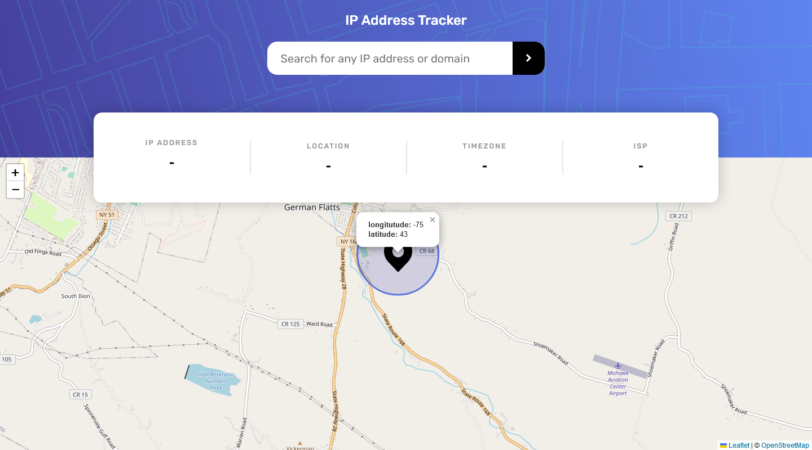
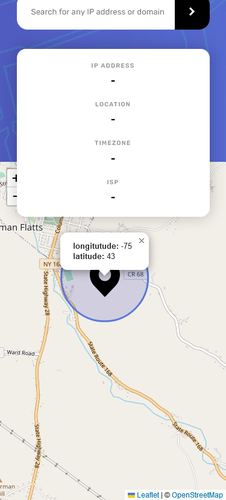

# Frontend Mentor - IP address tracker solution

This is a solution to the [IP address tracker challenge on Frontend Mentor](https://www.frontendmentor.io/challenges/ip-address-tracker-I8-0yYAH0). Frontend Mentor challenges help you improve your coding skills by building realistic projects.

## Table of contents

- [Overview](#overview)
  - [The challenge](#the-challenge)
  - [Screenshot](#screenshot)
  - [Links](#links)
- [My process](#my-process)
  - [Built with](#built-with)
  - [What I learned](#what-i-learned)

## Overview

### The challenge

Users should be able to:

- View the optimal layout for each page depending on their device's screen size
- See hover states for all interactive elements on the page
- See their own IP address on the map on the initial page load
- Search for any IP addresses or domains and see the key information and location

### Screenshot

### `Desktop` Page Preview



### `Mobile` Page Preview



### Links

- Solution URL: (https://www.frontendmentor.io/solutions/ip-address-tracker-BRD4rhCMKy)
- Live Site URL: (https://ip-address-tracker-one-xi.vercel.app/)

## My process

### Built with

- Semantic HTML5 markup
- CSS custom properties
- Flexbox
- CSS Grid
- Mobile-first workflow
- Vanilla Javascript(Fetch API)

### What I learned

I learned how to use a third party API like `Leaflet` with the help of Vanilla Javascript `fetch() API`.

```js
function LeafletMap(longitude, latitude) {
  var map;
  const blackIcon = L.icon({
    iconUrl: '/assets/images/icon-location.svg',
    iconSize: [50, 65],
  });
  // If map is already initialized reset the map variable
  var container = L.DomUtil.get('map');
  if (container != null) {
    container._leaflet_id = null;
  }
  // Initialized the map with latituse and longitiude parameter of the function
  map = new L.map('map').setView([latitude, longitude], 15);
  // Add the customized blackIcon marker to the map with popup message giving user,s latitude and longitude info
  L.marker([latitude, longitude], { icon: blackIcon })
    .addTo(map)
    .bindPopup(
      `<b>longitutude:</b> ${longitude}<br><b>latitude:</b> ${latitude}`,
    )
    .openPopup();
  // Add a circle around the marker with custom color,radius and fill color
  L.circle([latitude, longitude], {
    color: '#5977df',
    fillColor: '#4c52b2',
    fillOpacity: 0.2,
    radius: 500,
  }).addTo(map);
  // Finally add map to the html doc
  L.tileLayer('https://tile.openstreetmap.org/{z}/{x}/{y}.png', {
    maxZoom: 19,
    attribution:
      '&copy; <a href="http://www.openstreetmap.org/copyright">OpenStreetMap</a>',
  }).addTo(map);
}
```
